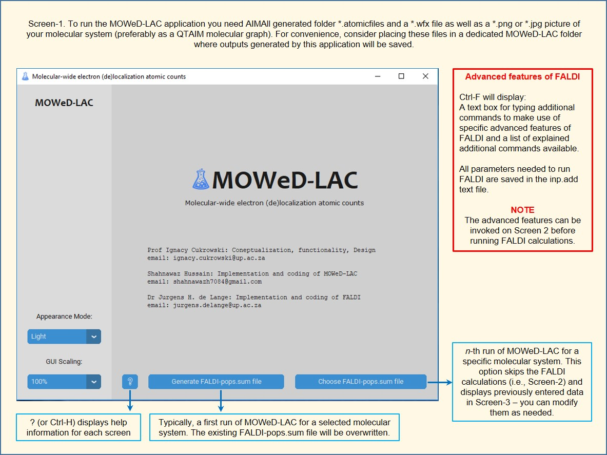
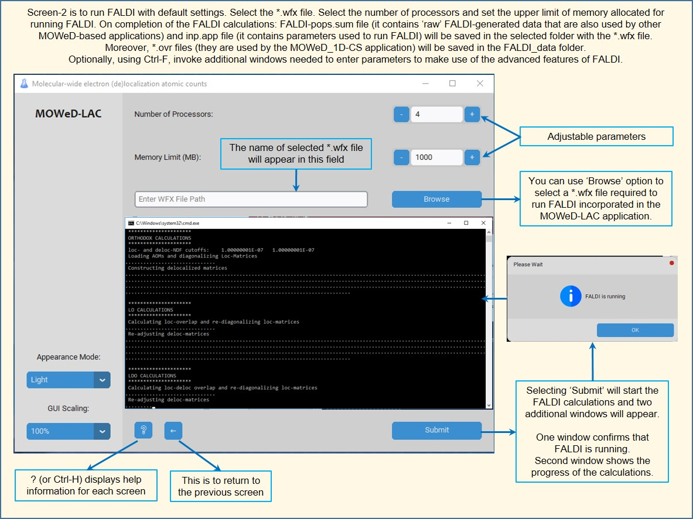
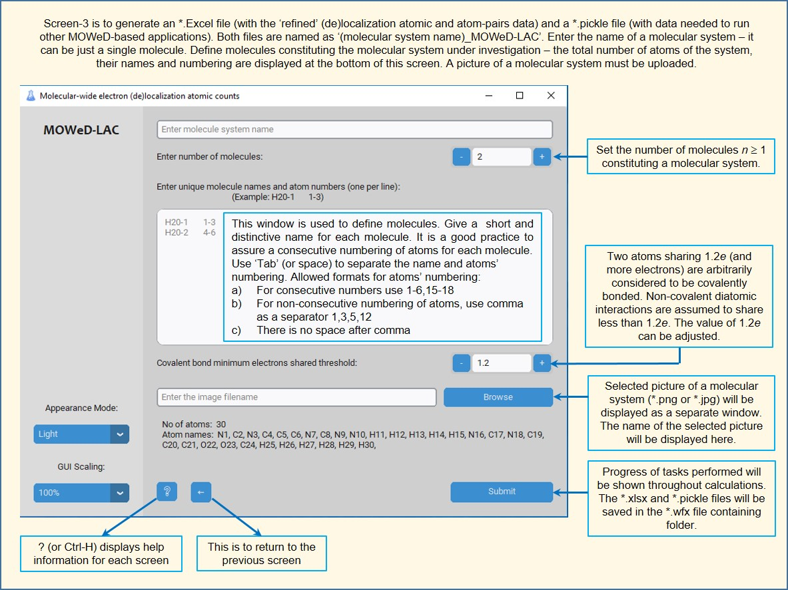
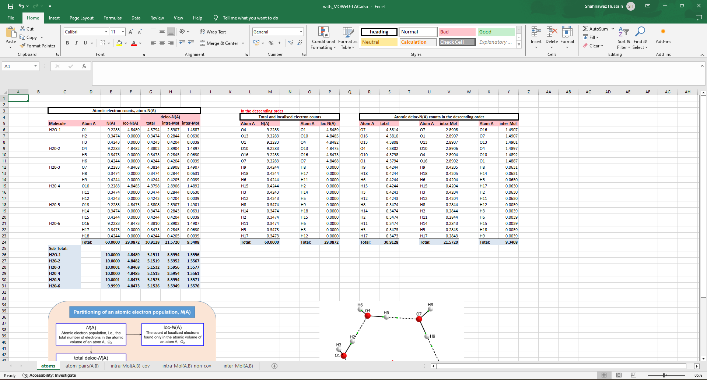
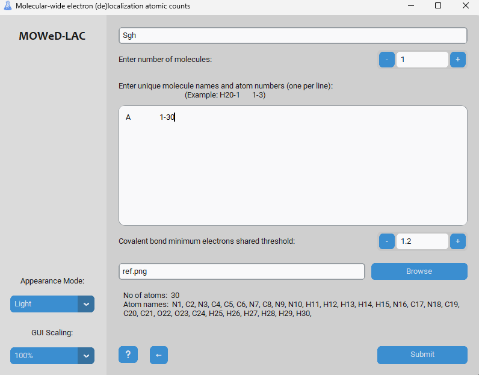

# Molecular-wide Electron Density (De)localization Atomic Counts (MOWed-LAC)

## Project Description

The Molecular-wide Electron Density (De)localization Atomic Counts (MOWed-LAC) is a desktop GUI application designed to process raw data from computational chemistry software and convert it into well-organized, research-ready Excel formats. This tool was developed under the supervision of Prof. Ignacy Cukrowski at the Natural and Agricultural Sciences Department, University of Pretoria, South Africa.

## Features

- **GUI Tool Development**: Utilized the Tkinter library to create an intuitive graphical user interface.
- **Data Processing**: Automated the conversion of complex textual outputs into organized Excel sheets.
- **User Inputs**: Enhanced data analysis with user-driven inputs for numerical and graphical insights.
- **Libraries Utilized**: Employed essential libraries such as `os`, `openpyxl`, `subprocess`, `Pillow`, `numpy`, `re` (regular expression), `pickle`, and `auto-py-to-exe`.
- **Executable Conversion**: Converted Python scripts into executable (.exe) files for user convenience.
- **Help Screen**: Includes a comprehensive help screen that guides users on how to use the software.

## Screenshots

### Main Interface


### Data Input



### Output Excel Sheet


### Light Mode


## Installation

To run the MOWed-LAC application, you need to have the AIMAll generated folder \*.atomicfiles and a \*.wfx file, as well as a \*.png or \*.jpg picture of your molecular system (preferably as a QTAIM molecular graph). For convenience, consider placing these files in a dedicated MOWed-LAC folder where outputs generated by this application will be saved.

1. **Clone the repository**:
    ```sh
    https://github.com/TheShahnawaaz/Molecular-Data-Analysis-and-Visualization-Tool.git
    ```

2. **Navigate to the directory**:
    ```sh
    cd Molecular-Data-Analysis-and-Visualization-Tool
    ```

3. **Install the required dependencies**:
    ```sh
    pip install -r requirements.txt
    ```

4. **Run the application**:
    ```sh
    python MOWeD-LAC.py
    ```

## Usage

1. **Generate FALDI-pops.sum file**: Click on the "Generate FALDI-pops.sum file" button to start processing.
2. **Choose FALDI-pops.sum file**: Alternatively, you can choose an existing FALDI-pops.sum file.
3. **Enter Molecular Data**: Provide the molecule system name, number of molecules, and unique molecule names with atom numbers.
4. **Set Covalent Bond Threshold**: Adjust the covalent bond minimum electrons shared threshold as needed.
5. **Submit**: Click the "Submit" button to generate the Excel file with refined data.

## Advanced Features

- **Appearance Mode**: Switch between dark and light modes.
- **GUI Scaling**: Adjust the scaling of the GUI for better readability.
- **Help Window**: Access detailed help information for each screen by pressing `Ctrl-H`.

## Suggested Literature

- [A unified molecular-wide and electron density based concept of chemical bonding](https://doi.org/10.1002/wcms.1579)
- [The CH⋯HC interaction in biphenyl](https://doi.org/10.1002/jcc.26491)
- [FALDI-based decomposition of an atomic interaction line](https://doi.org/10.1002/jcc.25175)

## Contributors

- **Prof. Ignacy Cukrowski**: Concept, functionality, and design.
  - Email: ignacy.cukrowski@up.ac.za
- **Mr. Shahnawaz Hussain**: Implementation and coding of MOWed-LAC.
  - Email: mowed.shahnawaz@gmail.com
- **Dr. Jurgens H. de Lange**: Implementation and coding of FALDI.
  - Email: jurgens.delange@up.ac.za

## Acknowledgments

Special thanks to the Natural and Agricultural Sciences Department at the University of Pretoria for their support and guidance.
